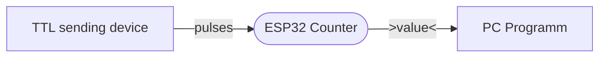
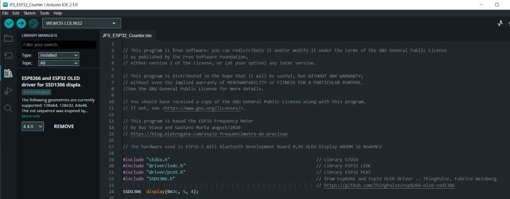
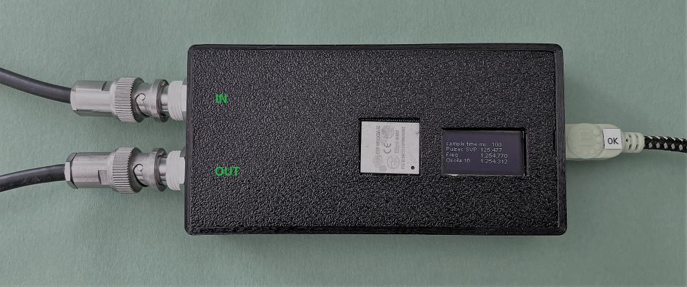
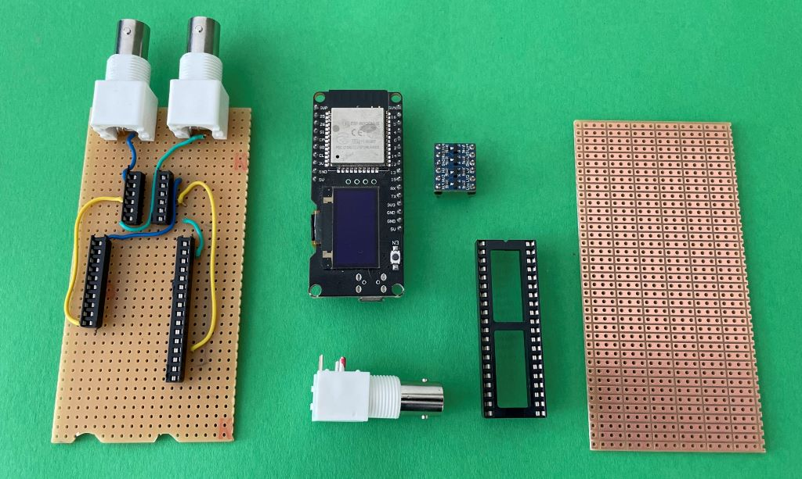
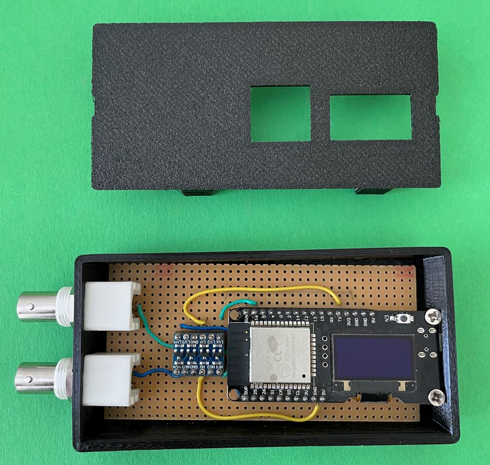
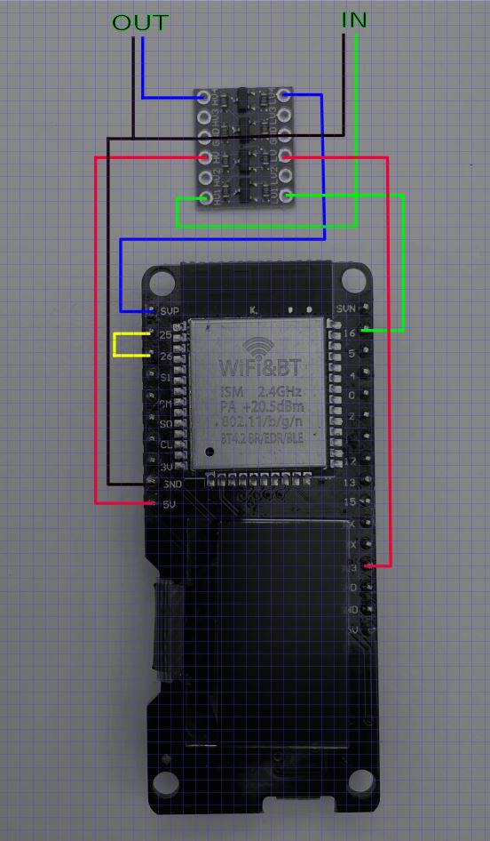

# JfsCounter

   

## About
A pulse counter based on a ESP32 with a OLED display. It counts the nummer of pulses during a fixed time frame.The idea was to build a small and cheap counter as an interface between a device witch genenerates 5V TTL an a GUI that runs on a PC.

   

## Software
### ESP32
The programmcode ** JFS_ESP32_Counter.ino ** is complide and uploaded via the ArduinoIDE:

   

### PC
This is the pip freeze output for compiling the ** counter.py ** programm:

<pre>
      Package                   Version
   ------------------------- ---------
   altgraph                  0.17.2
   future                    0.18.2
   numpy                     1.24.3
   opencv-python             4.6.0.66
   pefile                    2022.5.30
   pip                       22.2.1
   pyinstaller               5.9.0
   pyinstaller-hooks-contrib 2022.8
   PyQt5                     5.15.7
   PyQt5-Qt5                 5.15.2
   PyQt5-sip                 12.11.0
   pyqtgraph                 0.13.1
   PyQtWebEngine             5.15.6
   PyQtWebEngine-Qt5         5.15.2
   pyserial                  3.5
   pywin32-ctypes            0.2.0
   setuptools                63.2.0
   wheel                     0.37.1
</pre>

## Hardware
### Finished Device

   

### Parts
-  ESP32-S WiFi Bluetooth Development Board 0,96 OLED Display WROOM 32 NodeMCU
-  Pegelwandler 4 Kanal I2C IIC Logic Level Converter 5V~3.3V 
-  BNC-connector | Board | IC socket

   

### Case

   

### Scheme

   

## Thanks 

- This program is based the ESP32 Frequency Meter by Rui Viana and Gustavo Murta august/2020 [link](https://blog.eletrogate.com/esp32-frequencimetro-de-precisao)
- PyShine installer instructions [pyshine](https://www.youtube.com/watch?v=JjtqLPbh9-o)

